# 📄 Documento de Visión de Arquitectura

## 🔖 Cliente
Johanna Andrea Molina Rodriguez (Vicerrectoría de Desarrollo: Coordinadora de experiencia y servicio — Universidad de La Sabana)

## 👥 Integrantes del equipo
- Juan Esteban Ramirez 
- Julian David Aguilar

## 🗺️ Mapa conceptual de alto nivel

> Represente 4 a 6 cajas grandes (negocio, datos, aplicaciones, tecnología) — sin el nivel de detalle de un BPMN o un C4, ese trabajo llega en los Talleres 1 a 4. Puede usar un diagrama Mermaid (se renderiza en GitHub) o una imagen/boceto.

```mermaid
flowchart LR
    subgraph negocio["Negocio"]
        proc1["Planificación logística de encuestas"]
        proc2["Asignación de estudiantes PAT"]
        proc3["Notificación a profesores"]
    end
    subgraph datos["Datos"]
        info1["Horarios de clases"]
        info2["Muestra significativa (Semestres/Programas)"]
        info3["Disponibilidad estudiantes PAT"]
    end
    subgraph apps["Aplicaciones"]
        plat1["Power Automate (Automatización)"]
        plat2["Office 365 (Correo/Notificaciones)"]
        plat3["Excel/SharePoint (Base de datos)"]
    end
    subgraph tec["Tecnología"]
        nube["Nube (Ecosistema Microsoft)"]
    end

    negocio --> datos
    datos --> apps
    apps --> tec
```

## 🚀 Beneficios esperados

Cada fila debe conectar un objetivo estratégico de la Ficha de Caracterización con un beneficio concreto y medible.

| Objetivo estratégico (Ficha) | Beneficio esperado | Cómo se mide |
|---|---|---|
| Brindar una educación de calidad superior | Garantizar la participación representativa requerida para acreditaciones de alta calidad. | Porcentaje de cumplimiento de la muestra significativa de estudiantes encuestados por programa y semestre. |
| Escuchar a sus estudiantes para estar en continua mejora | Facilitar la recopilación de opiniones de los estudiantes al asegurar la logística sin contratiempos. | Número de encuestas de autosatisfacción completadas exitosamente frente a años anteriores. |
| Automatizar procesos para la optimización de recursos y tiempo | Reducción drástica del trabajo manual de la secretaría al cruzar horarios y enviar notificaciones. | Horas ahorradas en la planeación logística de la encuesta respecto al periodo anterior. |

## 🧭 Alcance

| En alcance | Fuera de alcance |
|---|---|
| Automatización del cruce de horarios entre clases y disponibilidad de estudiantes PAT. | Diseño, creación o modificación de las preguntas de la encuesta de autosatisfacción. |
| Filtro/Selección para identificar las clases que cumplen con la muestra significativa por programa y semestre. | Análisis de resultados y toma de decisiones post-encuesta. |
| Envío automático de notificaciones a los profesores sobre la realización de la encuesta en sus clases. | Uso de plataformas de terceros ajenas al ecosistema autorizado por la universidad. |
| Uso de herramientas del ecosistema Microsoft (Power Automate, Office 365). | Contratación de personal adicional para la logística de las encuestas. |

## 💡 Justificación

Esta visión de arquitectura propone la automatización de la logística requerida para la encuesta anual de autosatisfacción, respondiendo de manera directa a la necesidad de optimizar los recursos y tiempos. Al implementar un flujo automatizado para el cruce de horarios entre estudiantes PAT y clases, junto con el envío de notificaciones mediante Power Automate, se elimina una carga significativa de trabajo manual propenso a errores (Problema #1 identificado), permitiendo a la secretaría enfocarse en tareas de mayor valor.

Además, el sistema facilita la planeación al garantizar que se cubra una muestra significativa de estudiantes por cada programa y semestre. Esto permite que la universidad recopile la información indispensable para mantener sus acreditaciones de alta calidad y fomenta la mejora continua institucional al escuchar eficazmente a su comunidad.

Finalmente, la solución propuesta se alinea estrictamente con las restricciones tecnológicas declaradas por el cliente. Al utilizar Power Automate y el ecosistema de Office 365, el proyecto evita la adopción de herramientas externas no autorizadas, aprovechando las licencias actuales de la Universidad de La Sabana y garantizando el cumplimiento de los estándares de tecnología de la institución.

---

_Este documento hace parte de la entrega del Taller 0 del curso AREM (Arquitectura Empresarial) - Universidad de La Sabana._
