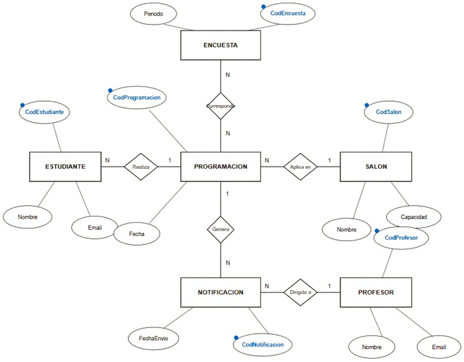
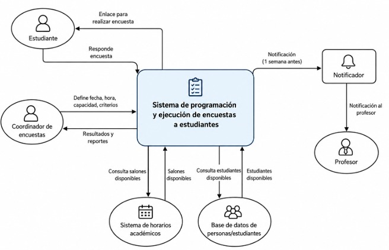

# 📄 Informe Técnico del Taller

## 🔖 Nombre del Taller
Taller 2 - Modelo de Información (ERD y Diagrama de Contexto)

## 👥 Integrantes del equipo
- Julián David Aguilar
- Juan Esteban Ramirez

## 🧠 Descripción general del trabajo

El objetivo del taller es modelar la información que maneja el sistema de programación y ejecución de las encuestas de autosatisfacción de la Universidad de La Sabana, y definir cómo se relaciona ese sistema con las personas y sistemas que lo rodean.

Se entregan dos modelos:

1. **Diagrama Entidad-Relación (ERD):** qué datos se manejan y cómo se relacionan entre sí.
2. **Diagrama de contexto:** qué hace el sistema como una sola caja y con quién intercambia información.

Ambos parten del proceso modelado en BPMN (Taller 1) y de la ficha de caracterización (Taller 0), y alimentan después el C4 (Taller 3) y el análisis de seguridad (Taller 5), donde los datos personales de estudiantes y profesores son el activo más sensible.

## 🔧 Proceso de desarrollo

La sesión de trabajo se realizó el 21 de agosto de 2026 con los dos integrantes del equipo.

1. Se analizaron los requerimientos del proceso: búsqueda de salones disponibles, identificación de los estudiantes disponibles en un horario y notificación previa, con una semana de anticipación, a los profesores.
2. Se definieron las entidades principales: Encuesta, Programación, Estudiante, Salón, Profesor y Notificación.
3. Se establecieron los atributos de cada entidad, sus identificadores y las cardinalidades entre ellas.
4. Se definió el sistema central como una sola caja y sus intercambios con actores y sistemas externos para el diagrama de contexto.
5. Herramienta usada: **draw.io**.

## 🧩 Análisis del modelo propuesto

### Cómo se estructura el modelo entregado

**ERD.** Tiene seis entidades, con **Programación** como entidad central, porque es la que une encuesta, estudiantes, salón y notificaciones.

| Relación | Cardinalidad (según el diagrama) | Lectura |
|---|---|---|
| Encuesta — Corresponde — Programación | N a N | Una encuesta puede tener varias programaciones y una programación puede incluir varias encuestas |
| Estudiante — Realiza — Programación | N a 1 | Varios estudiantes participan en una misma programación |
| Programación — Aplica en — Salón | N a 1 | Un salón puede alojar varias programaciones |
| Programación — Genera — Notificación | 1 a N | Cada programación genera una o más notificaciones |
| Notificación — Dirigida a — Profesor | N a 1 | Cada notificación va a un profesor, que puede recibir varias |

**Diagrama de contexto.** El sistema ("Sistema de programación y ejecución de encuestas a estudiantes") se representa como una caja que:

- Recibe del coordinador la fecha, hora, capacidad y criterios.
- Consulta los salones disponibles en el sistema de horarios académicos.
- Consulta los estudiantes disponibles en la base de datos de personas/estudiantes.
- Programa la realización de las encuestas.
- Notifica al profesor, a través de un notificador, con una semana de anticipación.
- Envía el enlace de la encuesta al estudiante y registra sus respuestas.
- Entrega resultados y reportes al coordinador.

### Cómo representa las necesidades del cliente

Las expectativas de la cliente son evitar que la encuesta se aplique sin que los profesores sean notificados y evitar el tiempo que consume crear los horarios manualmente. El modelo responde a ambas: la entidad Notificación, ligada a cada Programación y dirigida a un Profesor, deja trazabilidad de qué profesor fue avisado y cuándo (`FechaEnvio`), y el cruce de salones y estudiantes disponibles queda como responsabilidad del sistema y no de la coordinadora. Además, la restricción de usar solo herramientas autorizadas por la universidad no condiciona el modelo, que es independiente de la tecnología.

### Qué supuestos se tomaron

- La información de salones, estudiantes y profesores proviene de los sistemas institucionales (SIGA, según los talleres posteriores). El diagrama de contexto la nombra de forma genérica como "Sistema de horarios académicos" y "Base de datos de personas/estudiantes".
- El "Notificador" del contexto es el servicio de correo institucional; en el C4 (Taller 3) se nombra como Correo Institucional.
- Los datos personales que maneja el modelo (nombre y correo de estudiantes y profesores) los tiene la universidad en SIGA y la coordinadora tiene acceso a ellos; el modelo no los captura de nuevo, los reutiliza.

### Observaciones y límites del modelo

- **Cardinalidad Programación — Salón.** El texto de la sesión decía que una programación "puede realizarse en diferentes salones", pero el diagrama muestra un salón por programación (N a 1). Este informe sigue el diagrama. Si una programación debe poder usar varios salones, hay que cambiar la relación a N a N.
- **Respuestas de la encuesta.** El diagrama de contexto indica que el sistema registra las respuestas de los estudiantes, pero el ERD no tiene una entidad para ellas. Quedó como mejora para una versión posterior del modelo.
- **Programa, semestre y clase.** La muestra significativa por programa y semestre (alcance de la visión) y el cruce con las clases del profesor no aparecen como entidades o atributos. Tampoco aparece el estudiante PAT como rol distinto del estudiante. Quedan como ampliación del modelo cuando se detalle el repositorio de datos.
- **Respuesta del profesor.** La entidad Notificación no guarda si el profesor aceptó o rechazó, aunque el BPMN tiene esa decisión. Debería añadirse un atributo de estado.

## 📈 Diagrama final entregado

### Modelo ERD

Archivo editable: [`erd-final.drawio`](erd-final.drawio)

### Diagrama de contexto

Archivo editable: [`diagrama-contexto-final.drawio`](diagrama-contexto-final.drawio)

## 📋 Tabla de actores, entidades o componentes

| Nombre del elemento | Tipo | Descripción | Atributos / Responsable |
|---|---|---|---|
| Encuesta | Entidad | Encuesta de autosatisfacción que se aplica por periodo | CodEncuesta (PK), Periodo |
| Programación | Entidad | Agendamiento de la aplicación de la encuesta | CodProgramacion (PK), Fecha |
| Estudiante | Entidad | Estudiante que participa en la programación | CodEstudiante (PK), Nombre, Email |
| Salón | Entidad | Espacio físico donde se aplica la encuesta | CodSalon (PK), Nombre, Capacidad |
| Profesor | Entidad | Docente cuya clase se usa para la encuesta | CodProfesor (PK), Nombre, Email |
| Notificación | Entidad | Aviso enviado al profesor sobre la encuesta | CodNotificacion (PK), FechaEnvio |
| Coordinador de encuestas | Actor externo | Define fecha, hora, capacidad y criterios, y recibe resultados | Vicerrectoría de Desarrollo |
| Sistema de horarios académicos | Sistema externo | Provee los salones disponibles | Universidad de La Sabana |
| Base de datos de personas/estudiantes | Sistema externo | Provee los estudiantes disponibles | Universidad de La Sabana |
| Notificador | Sistema externo | Envía la notificación al profesor | Universidad de La Sabana |
| Profesor | Actor externo | Recibe la notificación una semana antes | Docentes de la universidad |
| Estudiante | Actor externo | Recibe el enlace y responde la encuesta | Estudiantes participantes |

## 🔍 Investigación complementaria

### Tema investigado:
Modelado entidad-relación (notación de Chen) y diagramas de contexto para sistemas de información administrativos.

### Resumen:
El modelo entidad-relación describe los datos de un sistema mediante entidades, atributos y relaciones con cardinalidad. Se usó la notación de Chen (rectángulos para entidades, óvalos para atributos, rombos para relaciones, identificadores marcados), útil en esta etapa porque deja explícita la lectura de cada relación en lenguaje de negocio ("Estudiante realiza Programación", "Notificación dirigida a Profesor") y puede validarse con la cliente sin conocimientos técnicos. El diagrama de contexto, a su vez, es la vista de mayor nivel de abstracción: muestra el sistema como una caja única y define su frontera, que es el mismo punto de partida del nivel C1 del modelo C4 usado en el Taller 3.

Esta investigación se relaciona con el taller porque justificó separar el trabajo en dos vistas complementarias: el ERD responde "qué información existe" y el contexto responde "quién interactúa con el sistema", y la consistencia entre ambas (por ejemplo, que cada actor que recibe o entrega datos tenga una entidad o un atributo detrás) es lo que permite detectar vacíos como la falta de una entidad para las respuestas.

## 📚 Referencias

Ver [`referencias.md`](referencias.md) para el listado completo de fuentes consultadas.

---

_Este documento hace parte de la entrega del Taller 2 del curso AREM (Arquitectura Empresarial) - Universidad de La Sabana._
